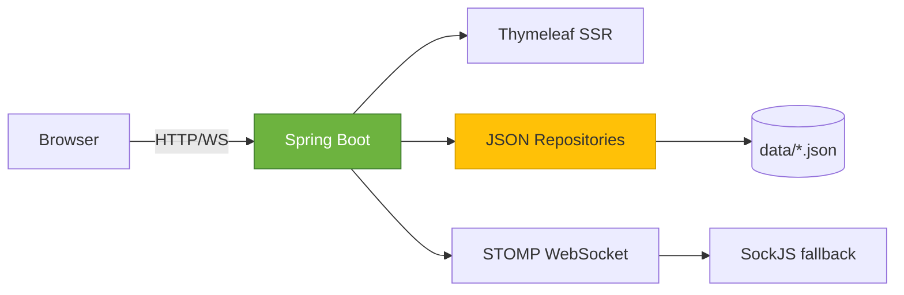

# 🤝 ColabConnect

> *Find your perfect collaborator, build together, earn trust*

[](https://spring.io/projects/spring-boot)
[](https://adoptium.net/)
[](https://stomp.github.io/)
[](CONTRIBUTING.md)


**ColabConnect** is a full‑stack collaboration platform where developers, designers, and creators discover each other, manage projects together, and build a reputation through peer endorsements – all with **real‑time chat** and a **clean Teams‑inspired UI**.

---

## ✨ Features at a glance

| Widget | Description |
|--------|-------------|
| 👥 **Discover People** | Search by skill, availability, work style – filter by popular tags instantly |
| 📁 **Project Hub** | Create projects, invite members, track status (open → active → completed) |
| 💬 **Real‑time Chat** | Project rooms + direct messages – WebSocket powered, unlimited after connection |
| 🔗 **Connection System** | Send join requests → accept → become collaborators → unlock full communication |
| ⭐ **Peer Ratings** | Rate teammates after project completion, build reliability score & endorsements |
| 🧩 **Skill‑based Matching** | Required skills on projects & user skills – find the right fit |
| 🍪 **Secure Auth** | HttpOnly session cookies, JSON file storage (easy to swap for DB) |

---

## 🧱 Tech Stack (the engine)



| Layer          | Technology                                               |
|----------------|----------------------------------------------------------|
| **Backend**    | Spring Boot 3, Java 19                                   |
| **Real‑time**  | WebSocket + STOMP + SockJS                               |
| **Persistence**| JSON files (ConcurrentHashMap + Jackson)                 |
| **Frontend**   | Thymeleaf, Vanilla JS, Boxicons                          |
| **Styling**    | Custom CSS (Microsoft Teams aesthetic)                   |
| **Build**      | Maven                                                    |

---

## 🚀 Quick Start (run in 2 minutes)

### Prerequisites
- Java 19+
- Maven (or use wrapper)

### 1. Clone & build
```bash
git clone https://github.com/yourusername/colabconnect.git
cd colabconnect
./mvnw clean package
```

### 2. Run
```bash
java -jar target/colabconnect-0.0.1-SNAPSHOT.jar
```
Or from IDE: run `ColabConnectApplication.java`

### 3. Open browser
👉 [http://localhost:8080](http://localhost:8080)

**Demo credentials**  
Email: `alex@example.com`  
Password: `password123`

---

## 📂 Project Structure (neatly explained)

```
colabconnect/
├── src/main/java/com/colabconnect/
│   ├── config/               # Auth interceptors, WebSocket config
│   ├── controller/           # REST endpoints + view controllers
│   ├── model/                # Plain Java entities (User, Project, etc.)
│   ├── repository/           # Interfaces + JSON implementations
│   │   └── json/             # File-based storage (data/*.json)
│   └── service/              # (optional) business logic
├── src/main/resources/
│   ├── static/               # CSS, JS, images
│   │   ├── css/styles.css
│   │   └── js/*.js           # Page-specific scripts (dashboard, chat, etc.)
│   ├── templates/            # Thymeleaf HTML (layout + pages)
│   └── application.properties
├── data/                     # Auto-created at runtime – your JSON database
│   ├── users.json
│   ├── projects.json
│   ├── sessions.json
│   ├── connections.json
│   ├── chats_projects.json
│   ├── chats_dms.json
│   └── ratings.json
└── pom.xml
```

> 💡 **No database?** No problem – the JSON repository pattern makes it portable. Swap to PostgreSQL later by implementing the same repository interfaces.

---

## 🧩 Core Workflows (visual)

### 🔁 Project lifecycle
```
[open] → (owner adds members) → [active] → (all members vote) → [completed] → (rate teammates)
```

### 🤝 Connection flow
```
User A requests to join Project X (owner = User B)
  → User B accepts
  → both become members
  → chat unlocked, can add each other to other projects
```

### 💬 Guest messaging (clever limit)
- Non‑member = **1 introductory message** per chat
- After that, get a connection → unlimited messaging

---

## 📡 API Endpoints Overview

| Category | Method | Endpoint | Description |
|----------|--------|----------|-------------|
| **Auth** | POST | `/cc/auth/register` | Create account |
| | POST | `/cc/auth/login` | Login (sets cookie) |
| | POST | `/cc/auth/logout` | Logout |
| **Users** | GET | `/cc/users/me` | Current user profile |
| | PUT | `/cc/users/me` | Update profile |
| | GET | `/cc/users?query=...` | Search collaborators |
| **Projects** | GET | `/cc/projects?scope=mine/all` | List projects |
| | POST | `/cc/projects` | Create new project |
| | POST | `/cc/projects/{id}/complete` | Vote to complete |
| | POST | `/cc/projects/{id}/rate/{userId}` | Rate teammate |
| **Chat** | GET | `/cc/chat/{projectId}` | Get project messages |
| | POST | `/cc/chat/{projectId}` | Send project message |
| **DM** | GET | `/cc/dm` | List conversations |
| | GET/POST | `/cc/dm/{userId}` | Get/send direct message |
| **Connections** | GET | `/cc/connections/requests` | Pending join requests |
| | POST | `/cc/connections/request/{id}` | Send join request |
| | PUT | `/cc/connections/respond/{reqId}` | Accept/reject |


---

## 🎨 UI Highlights

- **Icon rail** – quick navigation with tooltips
- **Dark‑light adaptive** CSS custom properties
- **Responsive design** – collapses left panel on mobile
- **Toast notifications** – success/error messages
- **Real‑time chat** – live updates without page refresh

---

## 🧪 Testing & Debugging

Run the app, then:

- Check `data/*.json` – all state is human‑readable
- WebSocket logs appear in browser console
- Customise `application.properties` for port, static locations

```properties
server.port=${PORT:8080}
spring.web.resources.static-locations=classpath:/static/
```

---

## 🤝 Contributing

Contributions are welcome!  
1. Fork the repo  
2. Create a branch (`git checkout -b feature/amazing`)  
3. Commit changes  
4. Push to branch  
5. Open a Pull Request  

Please follow the existing code style and add comments where needed.

---

## 🙌 Acknowledgements

- [Boxicons](https://boxicons.com/) for crisp icons
- [STOMP.js](https://stomp-js.github.io/stomp-websocket/) for WebSocket messaging
- Microsoft Teams UI inspiration

---

**Made with ☕ and Spring Boot** – *connect, build, shine.*

--- 